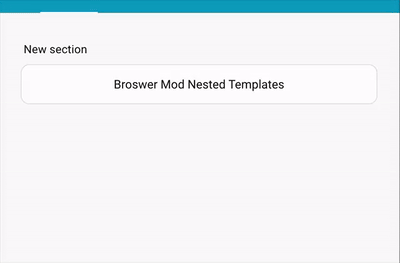

## Label JS templates


```yaml
- type: 'custom:button-card'
  color_type: icon
  entity: light.test_light
  label: |
    [[[
      var bri = states['light.test_light'].attributes.brightness;
      return 'Brightness: ' + (bri ? bri : '0') + '%';
    ]]]
  show_label: true
  size: 15%
  styles:
    card:
      - height: 100px
- type: 'custom:button-card'
  color_type: icon
  entity: light.test_light
  layout: icon_label
  label: |
    [[[
      return 'Other State: ' + states['switch.skylight'].state;
    ]]]
  show_label: true
  show_name: false
  styles:
    card:
      - height: 100px
```

## State JS Templates

The javascript code inside `value` needs to return `true` of `false`.

Example with `template`:

```yaml
- type: 'custom:button-card'
  color_type: icon
  entity: switch.skylight
  show_state: true
  show_label: true
  state:
    - operator: template
      value: |
        [[[
          return states['light.test_light'].attributes
          && (states['light.test_light'].attributes.brightness <= 100)
        ]]]
      icon: mdi:alert
    - operator: default
      icon: mdi:lightbulb
- type: 'custom:button-card'
  color_type: icon
  entity: light.test_light
  show_label: true
  state:
    - operator: template
      value: "[[[ return states['input_select.light_mode'].state === 'night_mode' ]]]"
      icon: mdi:weather-night
      label: Night Mode
    - operator: default
      icon: mdi:white-balance-sunny
      label: Day Mode
```

## Nested `custom:button-card`

A simple nested example. This could be completed with a non-nested card, but the simplicity of this example is to show using templates in nested button cards.

```yaml
type: custom:button-card
entity: sensor.skylight
custom_fields:
  nested:
    card:
      type: custom:button-card
      entity: light.bed_light
      name: | # (1)!
        [[[[
          return entity?.state === 'on' ? 'Light On' : 'Light Off';
        ]]]]
styles:
  grid:
    - grid-template-areas: '"nested"'
```

1.  The template has 4 opening and closing `[]`.

    The entity here is relative to the nested button-card's entity (light.bed_light) because the nested card will receive this JS template with 1 pair of `[]` removed, leaving 3 opening and closing `[]`.

    The nested card's configuration will be:

    ```yaml
    type: custom:button-card
    entity: light.bed_light
    name: |
      [[[
        return entity?.state === 'on' ? 'Light On' : 'Light Off';
      ]]]
    ```

## Nested templates in Browser Mod

This examples shows the effect of template nesting when included code may require the template **CODE** rather that the template **VALUE**. Here Browser Mod code uses a button-card. However it may also be applicable if the Browser Mod code used another card that also supported `[[[ ]]]` javascript templates.



```yaml
type: custom:button-card
show_label: true
label: Broswer Mod Nested Templates
section_mode: true
grid_options:
  rows: 1
  columns: 12
tap_action:
  action: fire-dom-event
  browser_mod:
    service: browser_mod.popup
    data:
      title: Nested Templates Example
      content:
        type: vertical-stack
        cards:
          - type: tile
            entity: light.bed_light
            vertical: false
            features_position: inline
            features:
              - type: toggle
          - type: markdown
            content: Non-nested template
            text_only: true
          - type: custom:button-card
            show_label: true
            label: | # (1)!
              [[[
                return `Light is ${states['light.bed_light'].state.toUpperCase()}`;
              ]]]
          - type: markdown
            content: Nested template
            text_only: true
          - type: custom:button-card
            show_label: true
            label: | # (2)!
              [[[[
                return `Light is ${states['light.bed_light'].state.toUpperCase()}`;
              ]]]]
```

1.  In this case, the card in the popup will get the following configuration which is the resulting string of the JS template evaluated by the main card (which is why the text doesn't update in the animation above):

    ```yaml
    label: Light is ON
    # or
    label: Light is OFF
    ```

2.  In this case, the card in the popup will get the configuration below (1 pair of `[]` removed) and it will then evaluate this JS template by itself:

    ```yaml
    label: |
      [[[
        return `Light is ${states['light.bed_light'].state.toUpperCase()}`;
      ]]]
    ```
